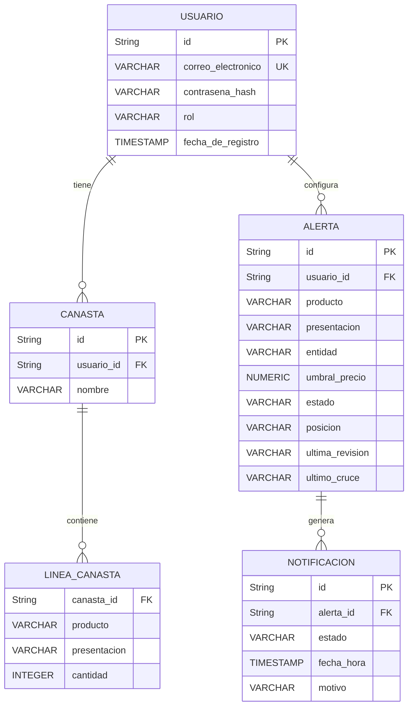

# Modelo entidad-relación

## Diagrama

## Restricciones

- La canasta pertenece exactamente a un usuario mediante `usuario_id` obligatorio.
- No se permiten dos líneas de la misma canasta con el mismo `producto` y `presentacion`.
- La `cantidad` debe ser un número entero mayor que cero.
- La identidad del artículo está formada por `producto` + `presentacion`.
- No se almacena `costo_estimado`; lo calcula la interfaz analítica cuando se necesita (P-10).
- La contraseña se almacena únicamente como `contrasena_hash`, nunca en texto plano.
- El `umbral_precio` debe estar dentro del rango histórico válido del artículo.
- La alerta se dispara cuando el precio observado es menor o igual al umbral (`<=`), **y sólo al cruzarlo** (D-05): avisa cuando `posicion` pasa de `ARRIBA` (o vacía, si es su primera revisión) a `DEBAJO`, y no repite mientras siga `DEBAJO`.
- La alerta vigila el precio de la entidad que guarda (P-14).
- Después de una notificación exitosa, la alerta permanece activa para futuras revisiones.
- Cada intento de notificación se registra con su estado (`PENDIENTE`, `ENVIADA` o `FALLIDA`) para permitir reintentos cuando falle; si falló, con su `motivo`.
- El `rol` se asigna al crear la cuenta: la app sólo crea cuentas `CONSUMIDOR`. Las de `ANALISTA` y `OPERADOR` se crean por configuración, no desde la app (P-07).
- El usuario no guarda nombre: se identifica con su correo (P-13).

## Entidades y columnas

### USUARIO

| Columna | Tipo | Restricción | Descripción |
|---|---|---|---|
| id | String | PK | Identificador único del usuario. |
| correo_electronico | VARCHAR | UNIQUE, NOT NULL | Correo electrónico del usuario. |
| contrasena_hash | VARCHAR | NOT NULL | Contraseña almacenada mediante hash. |
| rol | VARCHAR | NOT NULL, CHECK IN (`CONSUMIDOR`, `ANALISTA`, `OPERADOR`), DEFAULT `CONSUMIDOR` | Qué puede hacer: la app, el tablero o la consola (P-07). |
| fecha_de_registro | TIMESTAMP | NOT NULL | Fecha y hora de registro del usuario. |

### CANASTA

| Columna | Tipo | Restricción | Descripción |
|---|---|---|---|
| id | String | PK | Identificador único de la canasta. |
| usuario_id | String | FK, NOT NULL | Usuario propietario de la canasta. |
| nombre | VARCHAR | NOT NULL | Nombre asignado a la canasta. |

### LINEA_CANASTA

| Columna | Tipo | Restricción | Descripción |
|---|---|---|---|
| canasta_id | String | FK, NOT NULL | Canasta a la que pertenece la línea. |
| producto | VARCHAR | NOT NULL | Producto que identifica al artículo. |
| presentacion | VARCHAR | NOT NULL | Presentación que completa la identidad del artículo. |
| cantidad | INTEGER | CHECK > 0 | Cantidad de unidades del artículo. |

### ALERTA

| Columna | Tipo | Restricción | Descripción |
|---|---|---|---|
| id | String | PK | Identificador único de la alerta. |
| usuario_id | String | FK, NOT NULL | Usuario que configuró la alerta. |
| producto | VARCHAR | NOT NULL | Producto del artículo monitoreado. |
| presentacion | VARCHAR | NOT NULL | Presentación del artículo monitoreado. |
| entidad | VARCHAR | NOT NULL | Entidad cuyo precio vigila: la elegida en la app al crearla (P-14). |
| umbral_precio | NUMERIC(10,2) | NOT NULL | Precio máximo configurado para activar la alerta. |
| estado | VARCHAR | NOT NULL, CHECK IN (`ACTIVA`) | Estado actual de la alerta. |
| posicion | VARCHAR | CHECK IN (`ARRIBA`, `DEBAJO`); NULL mientras no se revisa | Dónde quedó el precio en la última revisión (D-05). |
| ultima_revision | VARCHAR | NULL o `AAAA-MM-Q1`/`-Q2` | Quincena de la última revisión. |
| ultimo_cruce | VARCHAR | NULL o `AAAA-MM-Q1`/`-Q2` | Quincena en que el precio cruzó hacia abajo por última vez. Con ella, la app sabe qué avisos son nuevos. |

### NOTIFICACION

| Columna | Tipo | Restricción | Descripción |
|---|---|---|---|
| id | String | PK | Identificador único del intento de notificación. |
| alerta_id | String | FK, NOT NULL | Alerta que originó la notificación. |
| estado | VARCHAR | NOT NULL, CHECK IN (`PENDIENTE`, `ENVIADA`, `FALLIDA`) | Resultado del intento (CU-11). |
| fecha_hora | TIMESTAMP | NOT NULL | Fecha y hora del intento de envío. |
| motivo | VARCHAR | NULL; obligatorio si `estado` es `FALLIDA` | Por qué falló el envío (CU-11, 6a). |