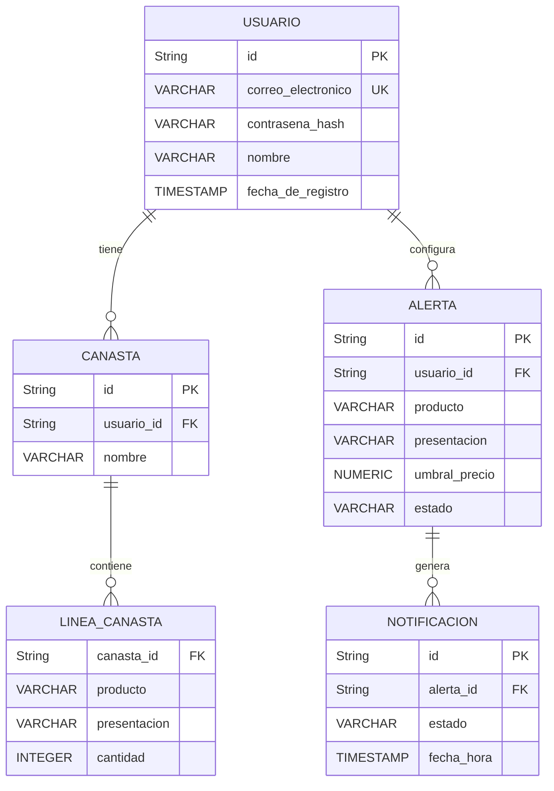

# Modelo entidad-relación

## Diagrama

## Restricciones

- La canasta pertenece exactamente a un usuario mediante `usuario_id` obligatorio.
- No se permiten dos líneas de la misma canasta con el mismo `producto` y `presentacion`.
- La `cantidad` debe ser un número entero mayor que cero.
- La identidad del artículo está formada por `producto` + `presentacion`.
- No se almacena `costo_estimado`; se calcula cuando se necesita.
- La contraseña se almacena únicamente como `contrasena_hash`, nunca en texto plano.
- El `umbral_precio` debe estar dentro del rango histórico válido del artículo.
- La alerta se dispara cuando el precio observado es menor o igual al umbral (`<=`).
- Después de una notificación exitosa, la alerta permanece activa para futuras revisiones.
- Cada intento de notificación se registra con su estado para permitir reintentos cuando falle.

## Entidades y columnas

### USUARIO

| Columna | Tipo | Restricción | Descripción |
|---|---|---|---|
| id | String | PK | Identificador único del usuario. |
| correo_electronico | VARCHAR | UNIQUE, NOT NULL | Correo electrónico del usuario. |
| contrasena_hash | VARCHAR | NOT NULL | Contraseña almacenada mediante hash. |
| nombre | VARCHAR | NOT NULL | Nombre del usuario. |
| fecha_de_registro | TIMESTAMP | NOT NULL | Fecha y hora de registro del usuario. |

### CANASTA

| Columna | Tipo | Restricción | Descripción |
|---|---|---|---|
| id | String | PK | Identificador único de la canasta. |
| usuario_id | String | FK, NOT NULL | Usuario propietario de la canasta. |
| nombre | VARCHAR | NOT NULL | Nombre asignado a la canasta. |

### LINEA_CANASTA

| Columna | Tipo | Restricción | Descripción |
|---|---|---|---|
| canasta_id | String | FK, NOT NULL | Canasta a la que pertenece la línea. |
| producto | VARCHAR | NOT NULL | Producto que identifica al artículo. |
| presentacion | VARCHAR | NOT NULL | Presentación que completa la identidad del artículo. |
| cantidad | INTEGER | CHECK > 0 | Cantidad de unidades del artículo. |

### ALERTA

| Columna | Tipo | Restricción | Descripción |
|---|---|---|---|
| id | String | PK | Identificador único de la alerta. |
| usuario_id | String | FK, NOT NULL | Usuario que configuró la alerta. |
| producto | VARCHAR | NOT NULL | Producto del artículo monitoreado. |
| presentacion | VARCHAR | NOT NULL | Presentación del artículo monitoreado. |
| umbral_precio | NUMERIC | NOT NULL | Precio máximo configurado para activar la alerta. |
| estado | VARCHAR | NOT NULL | Estado actual de la alerta. |

### NOTIFICACION

| Columna | Tipo | Restricción | Descripción |
|---|---|---|---|
| id | String | PK | Identificador único del intento de notificación. |
| alerta_id | String | FK, NOT NULL | Alerta que originó la notificación. |
| estado | VARCHAR | NOT NULL | Resultado del envío, por ejemplo enviada o fallida. |
| fecha_hora | TIMESTAMP | NOT NULL | Fecha y hora del intento de envío. |