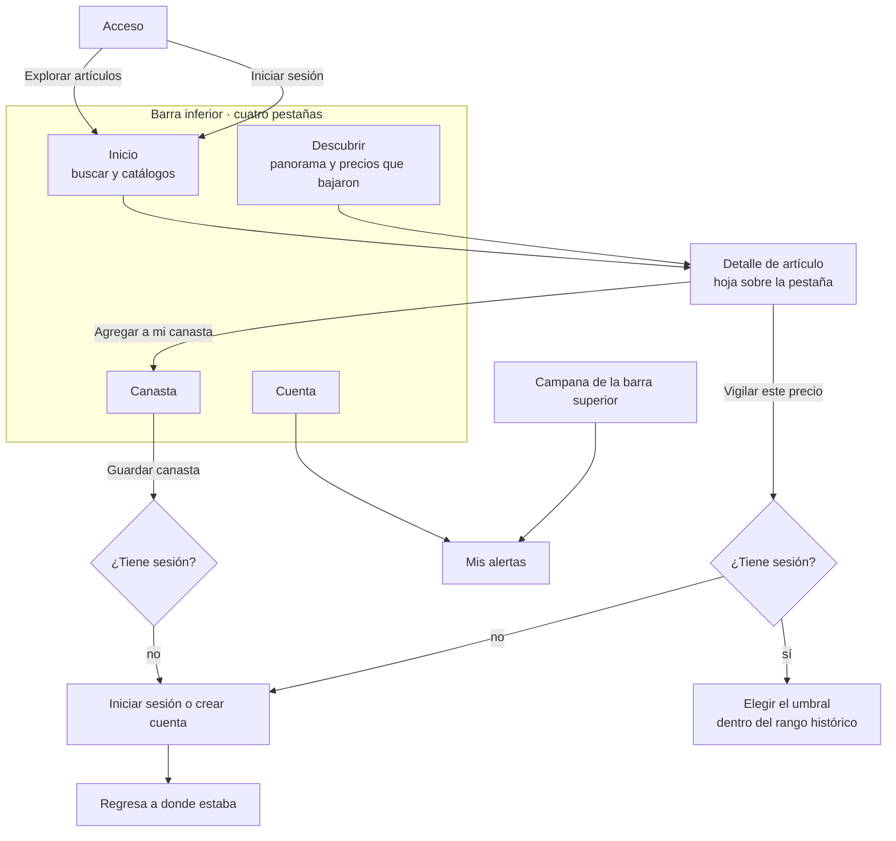
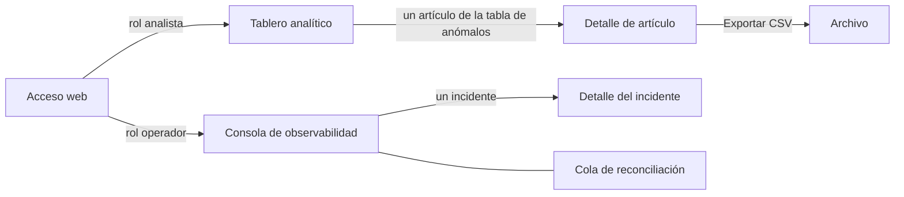
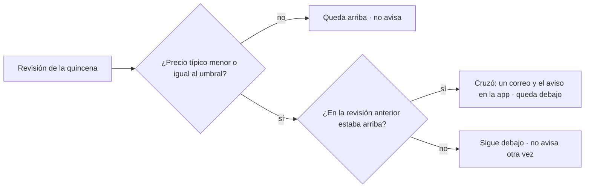
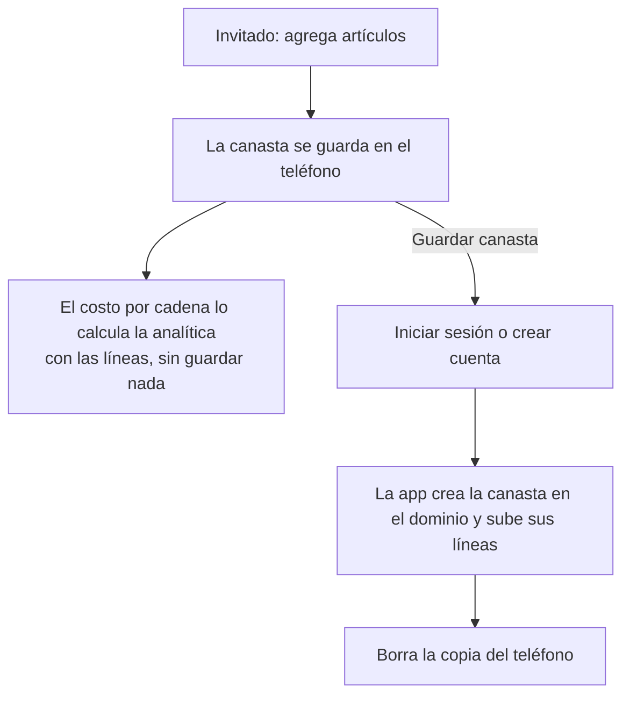

# Navegación y flujos · app y web

**Para:** C2 (Renato), que construye la app, y D (Karen), que diseña las dos ·
**Fecha:** 6 de octubre de 2026

Este documento dice **cómo se pasa de una pantalla a otra** y **qué pasa en cada
caso**. Qué contiene cada pantalla está en `inventario-vistas.md`, y cómo se ve, en
`docs/entregas/diseno.md`.

Integra cuatro decisiones del 6 de octubre (`docs/equipo/decisiones-pendientes.md`):

| Decisión | Resultado |
|---|---|
| **D-01** | Cuatro pestañas: Inicio, Descubrir, Canasta y Cuenta |
| **D-04** | La canasta del invitado vive en el teléfono hasta que inicia sesión |
| **D-05** | La alerta avisa cuando el precio **cruza** el umbral hacia abajo; no repite mientras siga abajo, y se vuelve a armar cuando sube. Dentro de la app, la idea de Renato |
| **D-06** | Los tonos de Figma, y el aviso en azul |

---

## 1 · La app

### Las cuatro pestañas

| Pestaña | Qué tiene | Sin sesión |
|---|---|---|
| **Inicio** | Buscador; chips de los 5 catálogos; ordenar por precio o marca; cuadrícula de artículos. Arriba, el aviso de precios que bajaron (§3) | Todo, menos el aviso |
| **Descubrir** | El panorama del estado: el índice por cadena del mes y la media por catálogo, cada uno con su población. Hasta abajo, **Precios que bajaron** (§3) | El panorama sí. En lugar de la sección de precios: «Inicia sesión para vigilar precios» |
| **Canasta** | Las canastas de la persona, por cadena, con su total | La canasta del teléfono (§4) |
| **Cuenta** | Perfil, **Mis alertas**, «Sobre nosotros» (con «No somos PROFECO») y cerrar sesión | «Iniciar sesión o crear cuenta» y «Sobre nosotros» |

### Lo que no es pestaña

| Pantalla | Cómo se abre | Cómo se cierra |
|---|---|---|
| **Detalle de artículo** | Tocando una tarjeta en Inicio o en Descubrir | La flecha, o el Atrás de Android |
| **Mis alertas** | La campana de arriba o Cuenta → Mis alertas | La flecha |
| **Modales de canasta** (elegir, crear, renombrar, borrar) | Desde Canasta o desde «Agregar a mi canasta» | Cancelar o la acción |

**La campana** lleva un globo con el número de alertas que cruzaron en la última
revisión y que la persona todavía no ha visto.

---

## 2 · La web

- **Analista:** su barra lateral tiene «Tablero analítico» y «Detalle de artículo».
- **Operador:** «Consola» y «Cola de reconciliación».
- **La barra de módulos de arriba del prototipo** (Acceso · Operador · Analista ·
  App) existe sólo para recorrerlo. El producto no tiene selector de rol: el rol
  lo da la sesión, y cómo se da está pendiente (P-07 de los contratos OpenAPI).

---

## 3 · Alertas de precio (D-05)

**Para:** Renato y Karen. Es la idea de Renato, ajustada a cómo llegan los datos.

### 3.1 · Cómo llegan los precios, y por qué importa

PROFECO publica **por quincena**. El sistema recibe los precios en lotes, y las
alertas se revisan **una vez por quincena**, cuando entra un lote (CU-11). No hay
cambios «por día» ni «por hora». En el peor caso son dos revisiones al mes. Hoy el
corpus está congelado desde julio de 2026, así que no se revisa ninguna.

Por eso, **la tabla de cambios es por quincena**, y el precio que se compara es el
**precio típico**: la mediana de las tiendas del estado en esa quincena (T031).

### 3.2 · La regla

La alerta recuerda si en la revisión anterior el precio estaba **arriba** o
**debajo** del umbral, y avisa sólo cuando pasa de arriba a debajo:

Con el ejemplo de la pechuga, «avísame si baja de **$85**»:

| Quincena | Precio típico | Posición | ¿Avisa? |
|---|---|---|---|
| 1 | $92 | arriba | — |
| 2 | $84 | debajo | **Sí:** acaba de cruzar |
| 3 | $83 | debajo | No: sigue abajo |
| 4 | $82 | debajo | No |
| 5 | $90 | arriba | No, pero se vuelve a armar |
| 6 | $84 | debajo | **Sí:** volvió a cruzar |

**Si el precio sube, se muestra pero no avisa** (quincena 5), como propuso Renato.

### 3.3 · Lo que ve la persona

1. **El correo.** Uno cada vez que una alerta cruza hacia abajo (CU-11).
2. **El aviso en Inicio.** Una franja arriba de la barra inferior: «Bajaron 2 precios
   que vigilas». Sólo aparece con sesión y si hubo cruces en la última revisión que
   la persona no ha visto. Al tocarla, abre Descubrir en la sección «Precios que
   bajaron». Es turquesa, no roja: una baja de precio es una buena noticia.
3. **«Precios que bajaron», hasta abajo de Descubrir.** Una tarjeta por alerta que
   está **debajo** de su umbral:
   - el artículo, con su ícono de catálogo;
   - el precio típico de hoy, con estado y quincena;
   - cuánto bajó contra la quincena anterior;
   - el umbral de la persona.
4. **El despliegue de una tarjeta.** Una tabla por quincena, con columnas «Quincena»,
   «Precio típico», «Cambio» y «¿Debajo de tu umbral?». Las quincenas en que el
   precio subió también aparecen, sin aviso. Debajo, tres botones: «Ver artículo»,
   «Cambiar umbral» y «Dejar de vigilar».
5. **Mis alertas** (campana o Cuenta). Todas las alertas, arriba o debajo, con su
   umbral. Desde ahí se cambian o se borran.

### 3.4 · Lo que se deja para después

Los dos botones de la propuesta, «avísame cada que el precio baje» y «avísame cuando
vuelva a su media habitual o deje de cambiar», **quedan como trabajo futuro**, por
tres razones:
- «media habitual» y «deje de cambiar» todavía no tienen definición;
- avisar cuando el precio *vuelve a subir* es otra alerta, no ésta;
- las alertas no son parte de las hipótesis H1 a H4, y la funcionalidad se congela
  el 18 de noviembre.

La regla de §3.2 ya evita el fastidio que motivó la propuesta.

### 3.5 · Qué datos usa

| Pantalla | Dato | De dónde |
|---|---|---|
| Aviso, Precios que bajaron y Mis alertas | Las alertas, su posición (arriba o debajo) y su última revisión | Dominio · `GET /api/v1/alertas` |
| Tabla por quincena | El precio típico del artículo en el estado, quincena por quincena | Analítica · `GET /api/v1/articulos/serie` |
| Cambiar umbral | El rango permitido | Analítica · `GET /api/v1/articulos/rango-historico` |

### 3.6 · Estados

| Caso | Qué se ve |
|---|---|
| Sin sesión | Ni aviso ni sección; en su lugar, «Inicia sesión para vigilar precios» |
| Con sesión, sin alertas | «Todavía no vigilas ningún precio» y el botón «Vigilar un precio» |
| Con alertas, ninguna debajo | La sección no aparece. Mis alertas las lista todas |
| Corpus congelado (hoy) | Nunca hay aviso, porque no hay revisiones. Los precios dicen julio de 2026 |

---

## 4 · La canasta del invitado (D-04)

- **El dominio no cambia:** toda canasta guardada tiene dueño (CU-09).
- **Si el inicio de sesión falla,** la canasta sigue en el teléfono; no se pierde nada.
- **Si la persona ya tenía canastas,** la del teléfono se sube como una canasta
  más. Se llama como la nombró la persona, o «Canasta de invitado».

---

## 5 · Estados de cada pantalla

| Estado | App | Web |
|---|---|---|
| Cargando | Esqueletos grises en el lugar de las tarjetas | Igual, por tarjeta |
| Vacío | Una frase que dice qué hacer, nunca una pantalla en blanco | Igual |
| Estado sin cobertura | «No tenemos datos de {estado}» y las 7 entidades cubiertas (CU-12 · 2b) | En el filtro de entidad, Colima y Nayarit sin datos (CU-13 · 1b) |
| Error del servicio | Notificación roja y «Reintentar» | Igual |
| Sin sesión | Lo de §1 | Regresa al acceso |
