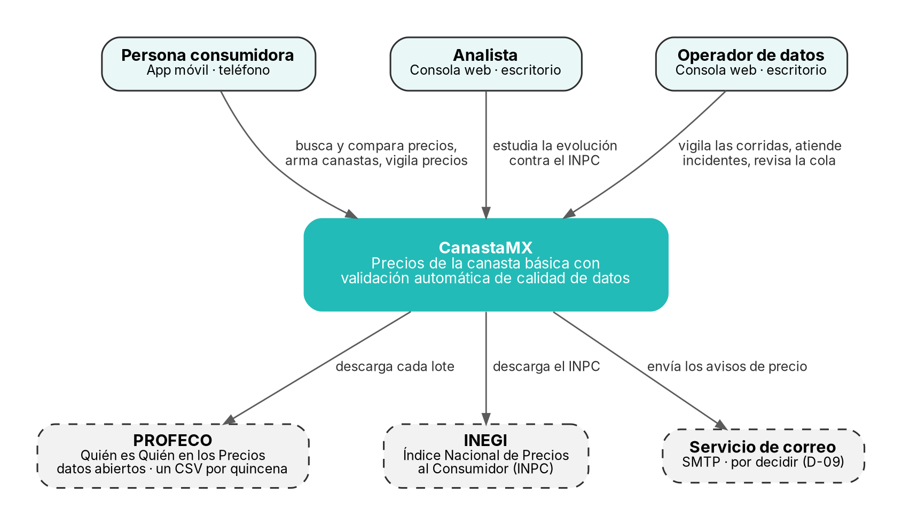
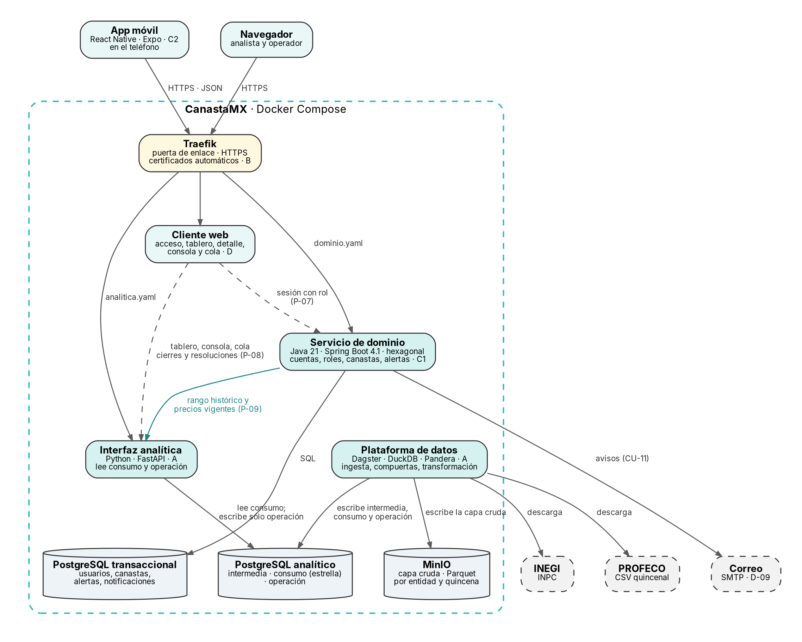
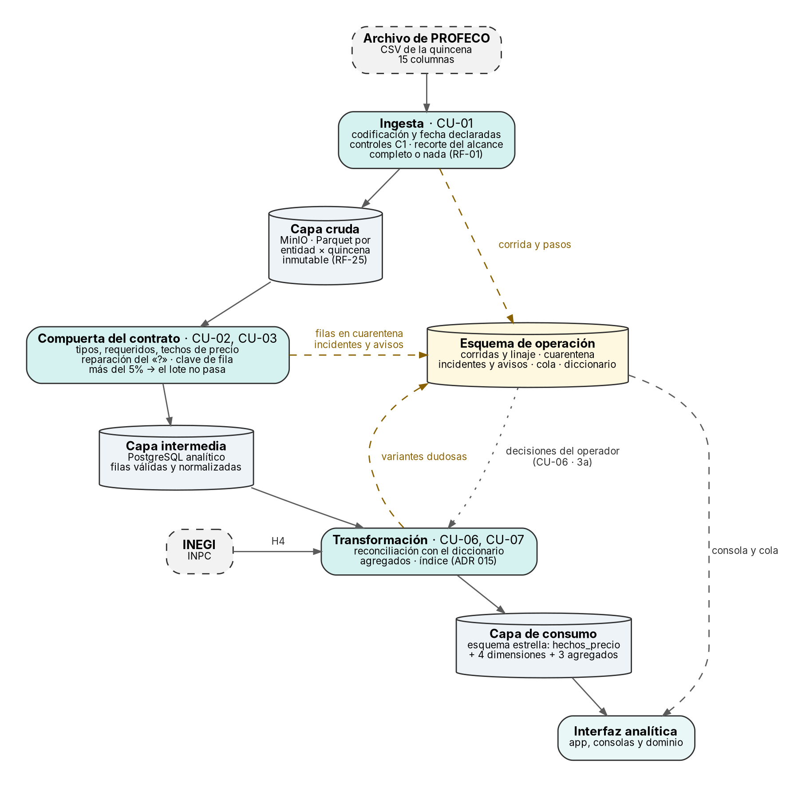
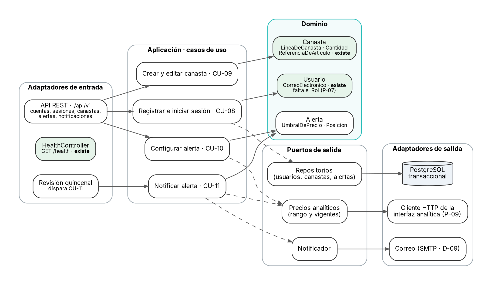
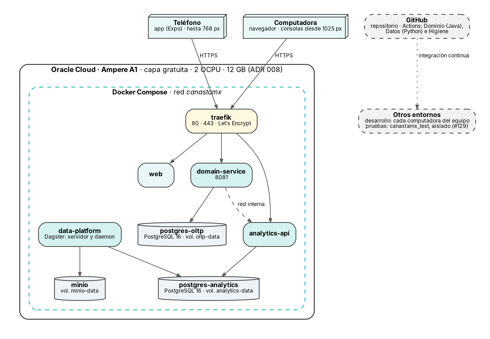

# Diseño arquitectónico

**Dueñas:** A (datos y plataforma), con B (infraestructura) · **Fecha:** 8 de octubre de 2026

**De dónde sale.** De lo que ya está decidido y escrito:
- el protocolo (§10.4 y §10.7);
- el `README`;
- `docker-compose.yml`;
- los ADR 001, 003, 008, 009, 012 y 015;
- los contratos (`contracts/qqp-v1.yaml` 1.3.4 y `docs/analisis/openapi/` 0.2);
- el modelo dimensional;
- el esquema de operación;
- las decisiones P-07 a P-10 y D-08.

Cada figura tiene su fuente en Graphviz (`.dot`) en esta carpeta. Para regenerarla:
`dot -Tpng -Gdpi=200 02-contenedores.dot -o 02-contenedores.png`.

---

## 1 · Los principios

| # | Principio | De dónde sale |
|---|---|---|
| 1 | **Componentes desplegables por separado**, comunicados por HTTP detrás de una sola puerta de enlace | Protocolo §10.7 · RNF-19 |
| 2 | **Una base por dueño de los datos:** la transaccional es del dominio y la analítica, de la plataforma | Protocolo §10.4 · README |
| 3 | **La capa cruda no se modifica nunca,** y desde ella se puede reprocesar cualquier lote | RF-25 · ADR 009 |
| 4 | **La capa de consumo sólo la escribe la plataforma.** La interfaz analítica escribe únicamente el esquema de operación | RNF-14 · P-08 |
| 5 | **El dominio lee de la analítica, nunca al revés**, y nunca escribe en ella | P-09 |
| 6 | **Una regla de negocio vive en un solo lugar:** el costo de la canasta lo calcula la analítica; la sesión con rol la emite el dominio | P-10 · P-07 |
| 7 | **Contrato primero:** nadie construye contra una interfaz que no esté escrita | Contrato 1.3.4 · OpenAPI 0.2 |

## 2 · Vista de contexto

| Elemento | Qué es | Qué intercambia con CanastaMX |
|---|---|---|
| Persona consumidora | Compara precios y arma su canasta desde el teléfono | Búsquedas, canastas, alertas; recibe los avisos por correo |
| Analista | Estudia la evolución de los precios contra la inflación | El tablero y el detalle de artículo |
| Operador de datos | Vigila la calidad de los datos | La consola, los incidentes y la cola de variantes |
| PROFECO | La única fuente de precios (R-01) | Un archivo CSV por quincena |
| INEGI | La inflación oficial | El INPC, para H4 |
| Servicio de correo | Entrega los avisos de precio | **Por decidir (D-09)** |

## 3 · Vista de contenedores

| Contenedor | Tecnología | Responsabilidad | Dueño |
|---|---|---|---|
| App móvil | React Native · Expo | Las vistas 6 a 8: búsqueda, canasta, cuenta y alertas | C2 |
| Cliente web | Next.js, según el README (ADR pendiente) | Las vistas 1 a 5: acceso, tablero, detalle, consola y cola. Sólo escritorio (D-08) | D |
| Traefik | Traefik 3.6 | Puerta de enlace única, HTTPS y certificados automáticos | B |
| Servicio de dominio | Java 21 · Spring Boot 4.1.1 (ADR 003) | Cuentas y sesión con rol, canastas, alertas y notificaciones | C1 |
| Interfaz analítica | Python · FastAPI | Precios, índice, consola y cola. Lee la capa de consumo | A |
| Plataforma de datos | Python · Dagster · DuckDB · Pandera | Ingesta, compuertas, cuarentena, transformación y reconciliación | A |
| PostgreSQL transaccional | PostgreSQL 16 | Usuarios, canastas, alertas y notificaciones (modelo ER) | C1 |
| PostgreSQL analítico | PostgreSQL 16 | Capa intermedia, capa de consumo (estrella) y esquema de operación | A |
| MinIO | MinIO (ADR 009 y 012) | Capa cruda: Parquet por entidad y quincena | A |

**Cómo se comunican:**

| De | A | Qué | Contrato o decisión |
|---|---|---|---|
| App móvil | Servicio de dominio | Cuentas, sesión, canastas y alertas | `dominio.yaml` |
| App móvil | Interfaz analítica | Búsqueda, precios, costo de la canasta, rango histórico y serie | `analitica.yaml` · P-10 |
| Cliente web | Servicio de dominio | Inicio de sesión con rol | P-07 |
| Cliente web | Interfaz analítica | Tablero, detalle, consola y cola; cierre de incidentes y resolución de variantes | P-08 |
| Servicio de dominio | Interfaz analítica | Rango histórico y precios vigentes, sólo lectura, por la red interna | P-09 |
| Servicio de dominio | Correo | Los avisos de precio (CU-11) | D-09 |
| Plataforma de datos | PROFECO e INEGI | Descarga del lote y del INPC | ADR 001 |
| Plataforma de datos | MinIO y PostgreSQL analítico | Escribe la capa cruda, la intermedia, la de consumo y la de operación | Contrato 1.3.4 |

## 4 · Vista de datos: el recorrido por capas

| Capa | Dónde vive | Quién la escribe | Quién la lee | Qué la gobierna |
|---|---|---|---|---|
| Cruda | MinIO, Parquet por entidad × quincena | Ingesta | Compuerta, reprocesos | Contrato: `archivo`, `alcance` |
| Intermedia | PostgreSQL analítico | Compuerta | Transformación | Contrato: `columnas`, `clave_de_fila`, `normalizacion` |
| Consumo | PostgreSQL analítico, esquema estrella | Transformación | Interfaz analítica | `docs/datos/modelo-dimensional.md` |
| Operación | PostgreSQL analítico, esquema `operacion` | Plataforma (crea); interfaz analítica (cierra y resuelve) | Interfaz analítica | `docs/datos/esquema-de-operacion.md` |

**Las compuertas** están en la frontera entre la capa cruda y la intermedia:
- **cada fila** que incumple el contrato va a cuarentena con su motivo;
- **un lote** con más del 5% de filas en cuarentena no se promueve (D-07);
- **cada corrida** registra su linaje, y su hora sirve para medir H2.

## 5 · Vista de componentes del servicio de dominio

El dominio sigue la arquitectura hexagonal (R-07). En verde, lo que ya existe en el
código: `HealthController`, `Usuario` y el agregado `Canasta`. Lo demás está diseñado
por los casos de uso CU-08 a CU-11 y el contrato `dominio.yaml`. Por eso las
dependencias apuntan hacia el dominio: cambiar PostgreSQL, el cliente HTTP o el
proveedor de correo no toca las reglas.

## 6 · Vista de despliegue

| Entorno | Dónde | Para qué |
|---|---|---|
| Desarrollo | La computadora de cada integrante, con Docker Compose | Construir y probar cada frente |
| Pruebas | `canastamx_test`, aislado: no repite nombres, puertos, volúmenes ni redes (#129) | Las pruebas automáticas y el experimento |
| Producción | Oracle Cloud, Ampere A1 de la capa gratuita: 2 OCPU y 12 GB (ADR 008) | La versión desplegada del 18 de noviembre |

**La memoria es la restricción real.** Son 12 GB para toda la pila (ADR 008). Cuánto
usa cada contenedor lo confirma B en el ADR 008, cuando entren Dagster y FastAPI.

## 7 · Atributos de calidad

| Atributo | Requerimiento | Táctica | Dónde |
|---|---|---|---|
| Rendimiento | RNF-05 a RNF-07 | Agregados precalculados; el tablero consulta agregados, no hechos; paginación | Modelo dimensional · P-05 |
| Integridad | RNF-09, RNF-10 · RF-24, RF-25 | Lote completo o nada; huella SHA-256 para no duplicar; capa cruda inmutable; umbral del 5% | Ingesta · contrato 1.3.4 |
| Contención y detección | SLA-D-04 · SLA-D-05 | Compuertas con cuarentena y motivo; el incidente guarda su hora | Esquema de operación · vista `deteccion` |
| Trazabilidad | SLA-D-09 · SLA-D-10 | `lote` e `ingerido_en` en cada hecho; linaje de cada corrida | Modelo dimensional · esquema de operación |
| Seguridad | RNF-11 a RNF-14 · RNF-21 | HTTPS en la puerta de enlace; sesión JWT con rol; contraseñas con BCrypt; secretos fuera del repositorio; consumo de sólo lectura | Traefik · dominio · CI |
| Mantenibilidad | RNF-17 | Tres trabajos de integración continua; contratos validados; ADR para cada decisión | GitHub Actions · `redocly.yaml` |
| Portabilidad | RNF-18 | Todo en contenedores; entornos aislados | `docker-compose.yml` · #129 |
| Usabilidad | RNF-15 · RNF-16 | Tres puntos de quiebre; app de teléfono y consolas de escritorio; población y fecha en cada cifra | `puntos-de-quiebre.md` · D-08 |
| Observabilidad | RF-12 | Los seis indicadores, calculados sobre las corridas | Vista `estado_de_la_plataforma` |

## 8 · Decisiones y pendientes

**Decisiones que sostienen esta arquitectura:**

| Decisión | Qué fija |
|---|---|
| ADR 001 | La fuente y el recorte |
| ADR 003 | Spring Boot 4.1.1 con Java 21 |
| ADR 008 | Oracle Cloud, Ampere A1 |
| ADR 009 y 012 | MinIO, y de dónde salen sus imágenes |
| ADR 015 | La canasta del índice |
| P-07 a P-10 | Sesión con rol, esquema de operación, el dominio lee de la analítica, y la analítica calcula el costo |
| D-08 | Consolas de escritorio |

**Lo que falta decidir o escribir:**

| Qué | Afecta | Quién |
|---|---|---|
| ADR 016 a 019: Dagster, FastAPI, Pandera y dbt | El contenedor de la plataforma y la interfaz analítica | A, con la firma de B |
| ADR del cliente web: Next.js, o el Vite que exporta Figma | El contenedor web | D |
| D-09: el servicio de correo | El contexto, los contenedores y el despliegue | C1 y B |
| La memoria de cada contenedor | El despliegue | B, en el ADR 008 |
