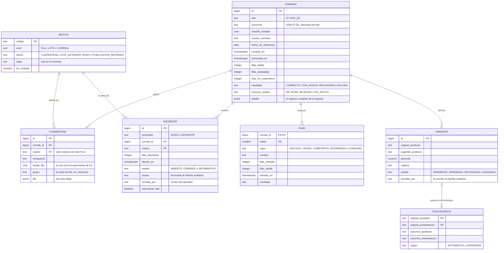

# Esquema de operación

**Dueña:** A · **Fecha:** 7 de octubre de 2026 · **SQL:** [`esquema-de-operacion.sql`](./esquema-de-operacion.sql)
· **Prueba:** [`probar-esquema-de-operacion.sql`](./probar-esquema-de-operacion.sql)

**Qué es.** Las tablas de lo que *le pasa* a los datos: cada corrida, cada fila
apartada, cada incidente y aviso, cada variante en la cola y cada decisión del
operador. Los precios están en la capa de consumo (`modelo-dimensional.md`); aquí
está su historia.

**Dónde vive.** En `postgres-analytics`, en el esquema `operacion`, aparte de la capa
de consumo (P-08).

**Quién escribe:**
- **La plataforma de datos crea** las filas de todas las tablas.
- **La interfaz analítica sólo cierra incidentes y resuelve variantes.** Sus columnas están marcadas en el SQL.
- **Nadie más escribe aquí,** y la interfaz analítica no escribe en la capa de consumo.

**Responde a** la pregunta del asesor «si un caso de uso habla de algo, ¿la tabla
existe?». Hasta hoy, la cola de CU-06 y CU-14, los incidentes de CU-04, las
corridas de CU-05 y la cuarentena de CU-02 no tenían tabla.

---

## 1 · El diagrama



## 2 · Las tablas

| Tabla | Qué guarda | De dónde sale | Quién escribe |
|---|---|---|---|
| `motivo` | El catálogo de las 18 reglas que apartan filas, detienen un lote o avisan | El contrato 1.3.4 y CU-01 | Se siembra con el SQL |
| `corrida` | Una fila por corrida. Un lote reprocesado tiene varias, y la vigente es la última | CU-01, CU-02 (paso 8), RF-08 | Plataforma |
| `paso` | Cada etapa de la corrida, con filas de entrada y salida y su hora | El linaje de CU-05 (paso 5) y RF-12 | Plataforma |
| `cuarentena` | Cada fila apartada, con su motivo, su compuerta y la fila tal como llegó | CU-02 (3a, 4a y 5a), SLA-D-09 | Plataforma |
| `incidente` | Incidentes y avisos. Los incidentes se cierran con causa, decisión, fecha y quién; los avisos no se cierran | CU-04, RF-13, SLA-D-09 | Plataforma (los abre) · Interfaz analítica (los cierra) |
| `variante` | La cola: la variante, la sugerencia, su parecido y la decisión del operador | CU-06 (2b), CU-14 | Plataforma (las detecta) · Interfaz analítica (las resuelve) |
| `equivalencia` | El diccionario de artículos: qué escritura es qué artículo canónico | CU-06 (pasos 3 y 3a), CU-14 (paso 5), RF-D10 | Plataforma |

**Del diccionario a la capa de consumo.** En cada corrida, la plataforma pasa a
`equivalencia` las variantes ya resueltas (la decisión del operador gana sobre la
automática, CU-06 · 3a). Con eso reescribe `dim_articulo.articulo_canonico_key`
(T053) y recalcula los agregados. Los hechos no se tocan.

**Las restricciones que hacen cumplir las reglas** (la base las rechaza):

| Regla | Restricción |
|---|---|
| Un motivo de lote no va a la cuarentena de filas | Llave compuesta `(motivo, nivel)` con `nivel = 'FILA'` |
| La colisión alta aparta el grupo completo | `colision_precio_alta` exige `grupo` |
| El lote tiene el formato de la fuente | `lote` como `07-2026_Q2`. El `L-2026-Q18` del prototipo no entra |
| El 100% de los incidentes cerrados tiene su causa (SLA-D-09) | Un incidente cerrado exige causa, decisión, fecha y quién |
| Los avisos no se cierran (RF-13) | Un aviso es siempre `INFORMATIVO` |
| Asignar a mano dice a qué artículo | `ASIGNADA` exige el artículo asignado |

## 3 · Los motivos

| Código | Nivel | Efecto | Regla del contrato |
|---|---|---|---|
| `codificacion_irrecuperable` | Fila | Cuarentena | `normalizacion.reparar_interrogantes.sin_gemelo` |
| `revision_humana` | Fila | Cuarentena | `normalizacion.reparar_interrogantes.ambiguo.empate` |
| `fecha_fuera_de_ventana` | Fila | Cuarentena | `columnas.fecha_registro.al_estar_fuera_de_rango` |
| `precio_fuera_de_rango` | Fila | Cuarentena | `columnas.precio.al_exceder` |
| `colision_precio_alta` | Fila | Cuarentena | `clave_de_fila.colision_precio_alta` |
| `valor_requerido_vacio` | Fila | Cuarentena | `columnas.*.valor_requerido` · **falta en el contrato** |
| `largo_excedido` | Fila | Cuarentena | `columnas.*.largo_maximo` · **falta en el contrato** |
| `tipo_invalido` | Fila | Cuarentena | `columnas.*.tipo` · **falta en el contrato** |
| `archivo_ilegible` | Lote | Lote detenido | `archivo.codificacion.al_fallar` |
| `controles_c1` | Lote | Lote detenido | `archivo.codificacion.compuerta_extra` |
| `fecha_ilegible` | Lote | Lote detenido | `archivo.formato_de_fecha.al_no_parsear` |
| `columna_requerida_faltante` | Lote | Lote detenido | CU-02 · 2b |
| `interrogante_en_filtro` | Lote | Lote detenido | CU-01 · 4a |
| `filas_de_otra_quincena` | Lote | Lote detenido | CU-01 · 6a |
| `rechazo_mayor_al_umbral` | Lote | Lote detenido | `promocion_del_lote.rechazo_maximo` (5%, D-07) |
| `columnas_extra` | Lote | Aviso | `columnas_extra.politica` |
| `frescura_avisa` | Corrida | Aviso | `frescura.avisa_dias` (20) |
| `frescura_bloquea` | Corrida | Deja de publicarse vigente | `frescura.bloquea_dias` (45) |

**Tres motivos todavía no tienen nombre en el contrato.** El contrato declara
`valor_requerido`, `largo_maximo` y `tipo` en cada columna, pero no qué pasa cuando
se incumplen. El protocolo pide declararlo antes de construir la compuerta (semana
del 9 de noviembre). Los nombres de esta tabla son la propuesta.

## 4 · Las vistas que lee la interfaz analítica

| Vista | Para qué | Ruta de `analitica.yaml` |
|---|---|---|
| `corrida_vigente` | La última corrida de cada lote (CU-05 · 5a) | `/operacion/corridas` |
| `estado_de_la_plataforma` | Los seis indicadores de CU-05, con la población de la cuarentena | `/operacion/estado` |
| `deteccion` | **H2:** minutos entre el inicio de la corrida y el incidente, y si cumple los 15 | Para el experimento (SLA-D-05) |
| `metricas_de_normalizacion` | Cobertura y precisión de la cola, con numerador, denominador y población | `/reconciliacion/cola` |

Cómo se calculan las métricas de la cola:
- **Cobertura:** variantes con decisión, automática o del operador, entre todas las detectadas.
- **Precisión:** sugerencias que el operador aprobó, entre las que revisó.
- **No es la medición de H3.** Ésa se hace en T058, sobre la muestra calificada de 200 pares (ADR 014).

**H1 se mide con la huella.** Cada fila en cuarentena guarda `huella_fila`, el SHA-256
de la fila tal como llegó. En el experimento (T075), la lista de filas inyectadas se
cruza con esa huella: qué proporción de las inyectadas quedó apartada (SLA-D-04).

## 5 · Cómo se prueba

Probado el 7 de octubre de 2026 en PostgreSQL 16, la versión del compose:

```bash
# Crear el esquema en la base analítica del compose
docker exec -i cmx-postgres-analytics psql -U canastamx -d canastamx_analytics \
  < docs/datos/esquema-de-operacion.sql

# El recorrido de prueba: inserta datos de ejemplo y al final los deshace
docker exec -i cmx-postgres-analytics psql -U canastamx -d canastamx_analytics \
  < docs/datos/probar-esquema-de-operacion.sql
```

El recorrido:
- registra una corrida con su linaje;
- aparta una fila;
- rechaza un lote, con un aviso y un incidente;
- mide la detección: 4 minutos, cumple H2;
- cierra el incidente;
- reprocesa el lote;
- resuelve tres variantes y calcula los seis indicadores.

Además, **seis operaciones que deben fallar fallan:** las seis reglas de la tabla del §2.
Al terminar no deja nada en la base.

## 6 · Lo que cambia en la plataforma

- **Hoy la ingesta guarda cada corrida como JSON** en `ingestion/corridas/`. Cuando
  exista el esquema, la inserta en `corrida`, con el JSON completo en `detalle`. El
  archivo puede quedar como respaldo.
- **La compuerta (CU-02) escribe en `cuarentena` y `paso`.** Si el lote pasa del 5%,
  abre un `incidente` con `rechazo_mayor_al_umbral`.
- **La reconciliación (CU-06) escribe en `variante` lo dudoso,** y en cada corrida
  pasa a `equivalencia` lo resuelto.

## 7 · Lo que queda abierto

| Qué | Quién · cuándo |
|---|---|
| Declarar en el contrato los tres motivos que faltan | A · antes de construir la compuerta (semana del 9 de noviembre) |
| Las tablas del experimento de H1: qué filas se inyectaron y con qué tipología | A · T075 |
| Cuánto tiempo se guardan las filas de `cuarentena`. Hoy son como máximo 5,992 filas, poco espacio | A · antes del despliegue |
