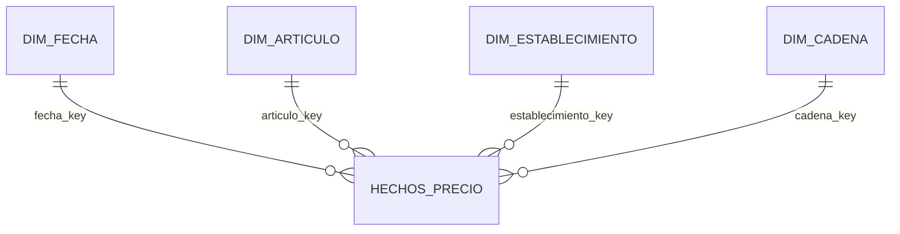

# Modelo dimensional · CanastaMX

> **Grano.** Una fila de `hechos_precio` es **una observación de precio publicada
> por PROFECO**: el precio de un artículo (producto + presentación) de una marca,
> en un establecimiento, en una fecha de registro. Entra después de reparar el `?`
> y de aplicar la clave de fila del contrato.

**T031** · issue #93 · Autora: A · Contrato de datos 1.3.3 · **Población: el
alcance del contrato**, 2,658,906 filas: 7 entidades, 5 catálogos y la ventana del
2025-01-01 al 2026-07-31.

---

## Por qué el grano es la observación y no «un precio por día»

La ficha proponía «un precio observado de un artículo en un establecimiento en una
fecha». **Esa combinación no es única**, por dos razones medidas:

- **La marca.** En la misma tienda y el mismo día, la leche Lala y la Alpura son
  dos precios del mismo artículo (ADR 002 §4). Sin la marca, chocan.
- **Las observaciones múltiples.** Aun con marca, el contrato conserva las dos
  filas cuando la fuente publicó dos precios que difieren entre $1 y $50 el mismo
  día (`clave_de_fila`). Son observaciones, no errores.

Por eso cada fila es **una observación**, y la combinación de artículo, marca,
establecimiento y fecha se puede repetir. Cuántas veces pasa está en las cifras
medidas (§7).

---

## 1 · El esquema



Vive en el almacén analítico (`postgres-analytics`), en la capa de consumo. Se
carga desde la capa intermedia, que es la que repara el `?`, normaliza, aplica la
clave de fila y separa la cuarentena con su motivo.

---

## 2 · Tabla de hechos · `hechos_precio`

| Columna | Tipo | Qué es |
|---|---|---|
| `observacion_id` | `bigint` · llave primaria | Identifica la observación y la liga con su fila de la capa cruda |
| `fecha_key` | `int` → `dim_fecha` | Fecha de registro, como `AAAAMMDD` |
| `articulo_key` | `int` → `dim_articulo` | El artículo: producto + presentación |
| `establecimiento_key` | `int` → `dim_establecimiento` | La tienda donde se observó |
| `cadena_key` | `smallint` → `dim_cadena` | La cadena **del día de la observación** |
| `marca` | `text` | Mayúsculas sin acentos; `S/M` es genérico |
| `es_generico` | `boolean` | `marca = 'S/M'`; las vistas lo mandan al final (ADR 002 §3) |
| `catalogo` | `text` | El catálogo de **esa** observación |
| `precio` | `numeric(12,2)` | **La medida**, en pesos |
| `lote` | `text` | El lote de la fuente del que vino, como `07-2026_Q2` |
| `ingerido_en` | `timestamptz` | Cuándo entró a la capa cruda, según el registro de la corrida |

**Tres decisiones, con su porqué:**

- **`marca` va en los hechos y no en el artículo.** El ADR 002 la define como
  «atributo del registro de precio, no del artículo»: un artículo tiene muchas
  marcas, así que no cabe como atributo suyo. La ficha decía lo contrario; gana el
  ADR, que está aceptado. Tampoco es una dimensión propia.
- **`catalogo` va en los hechos.** La clave del artículo no incluye el catálogo, y
  el mismo artículo puede llegar en dos (Carne Res es ancla de BASICOS y de PACIC
  en el contrato). Cuántos son está en §7.
- **`cadena_key` va en los hechos, aunque el establecimiento ya tiene cadena.** Así
  queda la cadena del día, y Mi canasta se divide por cadena comercial sin pasar
  por la tienda. No es teórico: hay establecimientos registrados con más de una
  cadena (§7).

**En los hechos no hay texto de tienda ni de artículo:** van llaves y medidas. Los
nombres viven una sola vez, en su dimensión.

---

## 3 · Las cuatro dimensiones

### `dim_articulo`

| Columna | Qué es |
|---|---|
| `articulo_key` | Llave subrogada. **Nunca sale del almacén**: se regenera al recargar |
| `producto_c`, `presentacion_c` | **Llave natural**: producto y presentación en su forma canónica. Es la misma que guarda el dominio (`ReferenciaDeArticulo.java`); las dos normalizaciones dieron idéntico en 22 de 22 casos difíciles |
| `producto`, `presentacion` | Cómo se muestran: la escritura más frecuente, ya reparada |
| `categoria` | La categoría más frecuente del artículo |
| `catalogo_principal` | El catálogo más frecuente. Decide el ícono del artículo (ADR 010 · 6) |
| `oculto_por_omision` | `true` para cerveza, vinos y licores, y cigarrillos (ADR 010 · 7) |
| `articulo_canonico_key` | El artículo con el que se reconcilia. Hoy es igual a `articulo_key`; T053 lo reescribe con la reconciliación de H3 (ADR 014) |

### `dim_establecimiento`

| Columna | Qué es |
|---|---|
| `establecimiento_key` | Llave subrogada |
| `nombre_c`, `direccion_c`, `municipio_c`, `entidad` | **Llave natural**, en forma canónica. Lleva municipio y entidad porque dos tiendas de ciudades distintas pueden compartir nombre y dirección (§7) |
| `nombre_comercial`, `direccion`, `municipio` | Cómo se muestran |
| `entidad` | Una de las 7 del alcance, unificada igual que en la ingesta |
| `giro` | Supermercado, mercado público, etcétera |
| `latitud`, `longitud` | Ubicación; pueden venir vacías (`valor_requerido: false`) |

### `dim_cadena`

| Columna | Qué es |
|---|---|
| `cadena_key` | Llave subrogada |
| `cadena_c` | Llave natural: forma canónica **sin la «s» final**. «Central de Abasto» y «Central de Abastos» son la misma; antes de unirlas, 24 establecimientos aparecían con las dos |
| `cadena_comercial` | Cómo se muestra |

### `dim_fecha`

| Columna | Qué es |
|---|---|
| `fecha_key` | `AAAAMMDD` |
| `fecha` | La fecha |
| `anio`, `mes` | Para filtrar por mes; el INPC es mensual y quincenal |
| `quincena` | `2026-07-Q2`: del día 1 al 15 es Q1, con la misma regla de la ingesta |
| `dia_semana`, `es_fin_de_semana` | Lunes es 1 |

Cubre todos los días de la ventana, haya o no observaciones.

**Cambios en el tiempo:** tipo 1, se sobrescribe. Con el corpus congelado no hay
historia que conservar en las dimensiones, y la cadena del día ya queda en los
hechos.

---

## 4 · Agregados: qué se precalcula y por qué

| Agregado | Grano | Lo usa | Por qué se precalcula |
|---|---|---|---|
| `agg_articulo_entidad_quincena` | artículo canónico × entidad × quincena · `n`, mínimo, p25, mediana, p75, máximo | Detalle de artículo (vista 3); tabla de anómalos del tablero (vista 2); compuerta fina de precio, pendiente del contrato | Las tres vistas lo piden en cada carga; el tablero tiene que responder en menos de 3 s (CU-13) |
| `agg_articulo_cadena_entidad_quincena` | artículo canónico × cadena × entidad × quincena · `n`, tiendas, mediana | **Mi canasta por cadena** (vista 7); comparar cadenas | El precio de una cadena es la **mediana de sus tiendas** en la entidad. El costo estimado de la canasta es la suma de cantidad × esa mediana. Si la cadena no tiene precio, dice «sin precio» |
| `rango_historico` | artículo canónico × entidad · desde, hasta | El dominio, al validar el umbral de una alerta (CU-10, ADR 010 · 5) | **Rango histórico = mínimo y máximo de las medianas quincenales** del artículo en la entidad. Con medianas, un precio atípico no estira el rango |
| Índice de canasta (H4) | quincena × entidad | Tablero, contra el INPC | **Se declara, no se construye todavía:** falta definir la canasta de H4 |

Los tres se calculan sobre `articulo_canonico_key`. Cuando T053 reconcilie
variantes, los agregados se recalculan y los hechos no se tocan.

---

## 5 · Diccionario

Cada columna en una línea, con la tabla donde vive.

| Columna | Tabla | Significa |
|---|---|---|
| `observacion_id` | hechos | Una observación de precio de la fuente |
| `precio` | hechos | Precio observado en pesos, `numeric(12,2)` |
| `marca` | hechos | Marca normalizada; `S/M` = sin marca |
| `es_generico` | hechos | La observación es de un producto sin marca |
| `catalogo` | hechos | Catálogo de PROFECO de esa observación |
| `lote`, `ingerido_en` | hechos | De qué lote vino la observación y cuándo entró. Cumplen RNF-D05 del protocolo: cada registro de consumo conserva su lote, su fuente y la hora de su ingesta |
| `articulo_key` | hechos, `dim_articulo` | Artículo = producto + presentación (ADR 002) |
| `articulo_canonico_key` | `dim_articulo` | Artículo al que se reconcilia una variante (T053) |
| `producto_c`, `presentacion_c` | `dim_articulo` | Forma canónica: sin acentos, sin signos, en minúsculas |
| `catalogo_principal` | `dim_articulo` | Catálogo más frecuente; decide el ícono |
| `oculto_por_omision` | `dim_articulo` | No sale en la canasta básica por omisión |
| `establecimiento_key` | hechos, `dim_establecimiento` | Tienda: nombre + dirección + municipio + entidad |
| `entidad` | `dim_establecimiento` | Entidad federativa, una de las 7 del alcance |
| `giro` | `dim_establecimiento` | Tipo de establecimiento |
| `cadena_key` | hechos, `dim_cadena` | Cadena comercial del día de la observación |
| `fecha_key` | hechos, `dim_fecha` | Fecha de registro, `AAAAMMDD` |
| `quincena` | `dim_fecha` | Quincena de publicación, `AAAA-MM-Q1` o `-Q2` |
| `n`, `n_tiendas` | agregados | Observaciones y tiendas detrás de una cifra |
| `mediana`, `p25`, `p75` | agregados | Cuantiles del precio observado |

---

## 6 · Requisitos no funcionales de datos

| Requisito | Número | Cómo se mide | De dónde sale |
|---|---|---|---|
| **Frescura** | **Avisa a los 20 días y bloquea a los 45** | Días entre la `fecha_registro` más reciente y la **fecha de referencia** de la corrida. No aplica mientras el corpus esté congelado (hoy, en 2026-07-Q2). En el experimento, la fecha se fija para inyectar datos viejos | Contrato 1.3.3 · ADR 010 · 9 |
| **Completitud · valores** | **0 vacíos** en las columnas con `valor_requerido: true` | Conteo por columna en el alcance (§7) | Contrato · `columnas` |
| **Completitud · cobertura** | **266 de 266** particiones de entidad × quincena (7 × 38) | Particiones con datos en los hechos (§7) | Ingesta T020 |
| **Completitud · cuarentena** | Cada fila apartada lleva su motivo, y el total se reporta como porcentaje del alcance | Cuarentena total (§7) | Contrato · motivos |
| **Detección · H2** | El incidente se señala en **menos de 15 minutos** desde el inicio de la ingesta | En el experimento: del inicio de la corrida al registro del incidente | Protocolo · RNF-D02 |
| **Trazabilidad** | **El 100% de las filas** de `hechos_precio` lleva su `lote` y su `ingerido_en` | Conteo de vacíos en esas dos columnas | Protocolo · RNF-D05 |
| **Latencia · consulta** | El tablero responde en **menos de 3 s** | Sobre los agregados, no sobre los hechos | CU-13 |
| **Peso** | Bytes por fila y total de `hechos_precio` | Estimación con la fórmula de `medir-el-peso.py` (§7) | Para el presupuesto de memoria de B (ADR 008) |

---

## 7 · Cifras medidas

<!-- cifras:inicio -->
> Generado el 2026-10-02 por `docs/datos/probar-modelo-dimensional.py` con el contrato 1.3.3. **Población: alcance del contrato.** No se escribe a mano: si algo cambia, se vuelve a correr.

| Cifra | Valor | Población · nota |
|---|---:|---|
| Filas del alcance | 2,658,906 | alcance · el contrato dice 2,658,906 ✓ |
| Vacíos en las columnas con valor requerido | 0 | alcance · 13 columnas |
| `?` que el diccionario no repara → cuarentena | 5,480 | alcance · COTA SUPERIOR: el contrato resuelve por frecuencia los ambiguos y aquí todavía no |
| Capturas dobles (sobrantes que se quitan) | 72,621 | alcance · el contrato midió 72,631 sin normalizar |
| Observaciones múltiples (sobrantes que se quedan) | 2,105 | alcance · el contrato midió 2,105 sin normalizar |
| Colisión de precio alta · filas a cuarentena (grupo completo) | 512 | alcance · eran 256 sobrantes en el contrato |
| Cuarentena total | 5,992 (0.225%) | porcentaje del alcance · cota superior |
| Filas en hechos_precio | 2,580,293 | alcance − capturas dobles − cuarentena · cota inferior |
| Artículos (dim_articulo) | 1,597 | alcance |
| Artículos con más de un catálogo | 246 | alcance · por eso `catalogo` va en los hechos |
| Artículos con más de una categoría | 2 | alcance |
| Establecimientos (dim_establecimiento) | 319 | alcance |
| Establecimientos con más de una cadena | 0 | alcance |
| Grupos de clave de fila que mezclan municipios o entidades | 0 | alcance · si es más de 0, la clave de fila necesita municipio y entidad |
| Cadenas (dim_cadena) | 45 | alcance |
| Días (dim_fecha) | 577 | ventana del contrato |
| Particiones entidad × quincena con datos | 266 | alcance · 7 × 38 = 266 si no falta ninguna |
| agg_articulo_entidad_quincena · filas | 286,489 | alcance |
| agg_articulo_cadena_entidad_quincena · filas | 1,106,140 | alcance |
| Bytes por fila de hechos en Postgres (estimado) | 80 | misma fórmula que medir-el-peso.py, sin índices |
| Peso de hechos_precio (estimado, sin índices) | 206 MB | alcance · para el presupuesto de B |
| Armado completo del modelo | 54.6 s | esta corrida, en esta máquina |

### Resultado de las tres consultas

**1 · ¿Cuánto costó el huevo blanco de 30 piezas en Guanajuato en julio de 2026?**

| producto | presentacion | observaciones | mediana | promedio | minimo | maximo |
|---|---|---|---|---|---|---|
| Huevo | Paquete C/30 Blanco | 47 | 65.00 | 65.83 | 59.00 | 91.00 |

**2 · ¿Qué cadena tuvo la canasta más barata en junio de 2026? (índice relativo, sin alcohol ni tabaco)**

| cadena_comercial | articulos | indice |
|---|---|---|
| Central de Abastos | 322 | 0.897 |
| Neto (super Precio) | 102 | 0.908 |
| Bodega Aurrera Express | 234 | 0.936 |
| Bodega Aurrera | 734 | 0.944 |
| Mercado del Mar Felipe Angeles Higueril | 36 | 0.954 |

**3 · ¿Cuántos artículos distintos se observaron en Michoacán la última quincena?**

| quincena | articulos |
|---|---|
| 2026-07-Q2 | 1,074 |
<!-- cifras:fin -->

---

## 8 · La prueba del grano: las tres consultas

Las tres se responden **sólo con el modelo**. Las corre `probar-modelo-dimensional.py`,
y sus resultados están en §7.

**1 · ¿Cuánto costó el huevo blanco de 30 piezas en Guanajuato en julio?** La
pregunta no dice el año, y julio existe en 2025 y en 2026; va con 2026. «Blanco»
puede venir en el producto o en la presentación, y PROFECO escribe «Paquete C/30
Blanco», sin la palabra «piezas»: por eso se busca el 30 como palabra suelta. Si esa
presentación no existe en la entidad y el mes, el guion lista los huevos que sí se
observaron: también es una respuesta, y la da el modelo.

```sql
SELECT a.producto, a.presentacion, count(*) AS observaciones,
       median(h.precio) AS mediana, round(avg(h.precio), 2) AS promedio,
       min(h.precio) AS minimo, max(h.precio) AS maximo
FROM hechos_precio h
JOIN dim_articulo a USING (articulo_key)
JOIN dim_establecimiento e USING (establecimiento_key)
JOIN dim_fecha f USING (fecha_key)
WHERE a.producto_c LIKE 'huevo%'
  AND regexp_matches(a.presentacion_c, '\b30\b')
  AND (a.producto_c LIKE '%blanc%' OR a.presentacion_c LIKE '%blanc%')
  AND e.entidad = 'Guanajuato' AND f.anio = 2026 AND f.mes = 7
GROUP BY ALL ORDER BY observaciones DESC;
```

**2 · ¿Qué cadena tuvo la canasta más barata en junio?** Un promedio simple de
precios compararía surtidos, no precios: gana la cadena que vende cosas baratas.
Por eso cada artículo se compara contra su propia mediana del mes, y se saca la
media geométrica por cadena: 1.000 es el precio típico y 0.950 es 5% más barata.
Va sin alcohol ni tabaco (ADR 010 · 7), y sólo cadenas con al menos 30 artículos.

```sql
WITH obs AS (
  SELECT h.cadena_key, a.articulo_canonico_key AS art, h.precio
  FROM hechos_precio h JOIN dim_articulo a USING (articulo_key) JOIN dim_fecha f USING (fecha_key)
  WHERE f.anio = 2026 AND f.mes = 6 AND NOT a.oculto_por_omision),
ref AS (SELECT art, median(precio) AS m FROM obs GROUP BY art),
por_art AS (SELECT o.cadena_key, o.art, median(o.precio) / r.m AS rel
            FROM obs o JOIN ref r USING (art) GROUP BY o.cadena_key, o.art, r.m)
SELECT c.cadena_comercial, count(*) AS articulos, round(exp(avg(ln(rel))), 3) AS indice
FROM por_art JOIN dim_cadena c USING (cadena_key)
GROUP BY ALL HAVING count(*) >= 30 ORDER BY indice LIMIT 5;
```

**3 · ¿Cuántos artículos distintos se observaron en Michoacán la última quincena?**
«La última» es la más reciente con datos: con el corpus congelado, 2026-07-Q2.

```sql
SELECT f.quincena, count(DISTINCT a.articulo_canonico_key) AS articulos
FROM hechos_precio h
JOIN dim_articulo a USING (articulo_key)
JOIN dim_establecimiento e USING (establecimiento_key)
JOIN dim_fecha f USING (fecha_key)
WHERE e.entidad = 'Michoacán'
  AND f.quincena = (SELECT max(f2.quincena) FROM hechos_precio h2 JOIN dim_fecha f2 USING (fecha_key))
GROUP BY ALL;
```

---

## 9 · Lo que este modelo deja abierto

- **T053 · reconciliación:** llena `articulo_canonico_key`. Hasta entonces, cada
  variante cuenta como artículo propio.
- **H4 · índice de canasta:** falta definir qué artículos forman la canasta.
- **La compuerta fina de precio:** compara cada precio contra su artículo, usando
  `agg_articulo_entidad_quincena`. Es pendiente del contrato.
- **La clave de fila no lleva municipio ni entidad.** Con los datos del 2 de
  octubre ningún grupo mezcla lugares (§7), así que el contrato no necesita
  cambiar. Si una medición futura da más de 0, se agregan por ADR.
- **El `?` ambiguo.** El contrato resuelve por frecuencia los valores ambiguos,
  sobre todo en `marca`, y manda a cuarentena sólo los que no tienen gemelo. Eso
  lo hará la capa intermedia; el guion de §7 todavía no lo aplica. Por eso la
  cuarentena de §7 es una **cota superior** y las filas de hechos, una **cota
  inferior**.
- **Variantes de cadena.** Los 24 establecimientos con dos cadenas eran la misma
  escrita en singular y en plural («Central de Abasto/Abastos»); la llave de
  `dim_cadena` ya las une. El guion lista cualquier otra variante que aparezca, y
  se agrega a la regla.
- **Categoría.** Sólo dos artículos traen dos categorías: el atún en lata, como
  «pescados y mariscos» y como «pescados y mariscos en conserva». `dim_articulo`
  se queda con la más frecuente.
- **Para la API (T037):** el artículo viaja por su llave natural, nunca por
  `articulo_key`.
- **Lo que no está en este modelo:** las corridas, la cuarentena, los incidentes,
  la cola de variantes y el diccionario de artículos. Viven en el esquema de
  operación, aparte de la capa de consumo (P-08): [`esquema-de-operacion.md`](./esquema-de-operacion.md).
