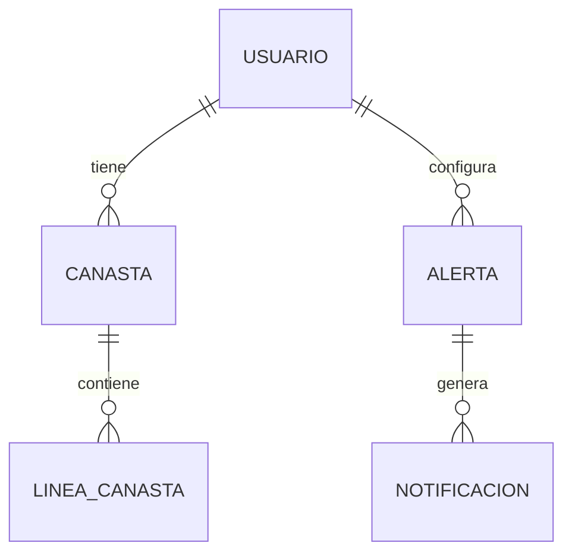

# Fichas · semana 4 · lunes 28 de septiembre al domingo 4 de octubre

> **Mismo formato que la semana 3,** porque funcionó. Cada ficha trae, en este
> orden: el nombre de tu rama, de qué depende, los términos raros explicados, el
> paso a paso, cómo se ve terminado y **cómo lo compruebas tú mismo** sin
> preguntarle a nadie.
>
> Si algo no se entiende, di **cuál sección** de cuál ficha.

## Lo que cambió durante la semana · viernes 2 de octubre

Las fichas de abajo se escribieron el lunes. Desde entonces se decidieron cosas que
las tocan, y van anotadas en su lugar:

- **Contrato de datos 1.3.3** (#124). En una colisión de precio de más de $50 va a
  cuarentena el grupo completo. La frescura avisa a 20 días y bloquea a 45 contra
  una fecha de referencia, y no aplica mientras el corpus esté congelado. Esto
  resuelve las dos dudas de CU-02 en T036.
- **Ingesta con protecciones** (#126). El lote se detiene ante controles C1, `?` en
  los filtros o filas de otra quincena.
- **T031 · modelo dimensional** quedó medido sobre el alcance. De ahí salen tres
  definiciones que usan otros frentes:
  - el precio de un artículo en una cadena es el de en medio entre sus tiendas del
    estado, en la quincena más reciente, y si no hay, «sin precio»;
  - el rango histórico para una alerta va del mínimo al máximo de esos precios
    típicos, quincena por quincena;
  - la cuarentena del alcance es como máximo de 5,992 filas (0.23%).
- **Fotos.** El ADR 010 · 6 ya había decidido un ícono genérico por catálogo. Aplica
  a T040.
- **El puerto 8081.** Al probar la guía con Git Bash (#127), C2 puso Traefik en el
  8081, que es el del servicio de dominio. Ver el aviso de abajo.

## La semana de un vistazo

| | mié 30 | vie 2 | dom 4 |
|---|---|---|---|
| **A** · Ariadne | T036 · CU-02 y CU-03 | T036 · CU-01, CU-04 y BPMN de ingesta | T036 · CU-05 a CU-07 y BPMN de incidentes |
| **B** · Ari Adair | T037 · sesión y `dominio.yaml` | T037 · los otros contratos | T037 · aprobaciones |
| **C1** · Liseth | | T038 · BPMN de alerta | T038 · entidad-relación |
| **C2** · Oscar | | T039 · el servicio corriendo en tu máquina | T039 · la llamada desde la app |
| **D** · Karen | | T040 · puntos de quiebre | T040 · prototipo cerrado y documento |

**La fecha límite oficial es el domingo 4 para todas.** Los días de la tabla son
sugeridos, y están puestos para que lo que desbloquea a otro salga primero:

- **`dominio.yaml` de B el miércoles 30**, porque la tarea de C2 lo consume.
- **Los casos de uso de A el domingo 4**, porque B los revisa la semana siguiente
  (revisión cruzada de la entrega del 9).

---

## La deuda de la semana 3 · antes que lo nuevo

Si arrastras algo, va primero: una tarea a medias bloquea a otro; una nueva
todavía no.

| Quién | Qué falta | Issue |
|---|---|---|
| **A** | ~~T031 · modelo dimensional~~ · **hecha**, medida el 2-oct | #93 |
| **B** | T021 · entornos, secretos y `pytest` en la integración continua | #92 |
| **B** | T032 · estrategia de ramas y plantillas | #94 |

---

## Aviso para todos · el puerto 8081 ya tiene dueño

El servicio de dominio escucha en el **8081**
(`services/domain-service/src/main/resources/application.properties`). La guía
de arranque sugería `TRAEFIK_WEB_PORT=8081` para quien tuviera ocupado el 80.
**Esas dos cosas chocan.**

**C2 ya lo tiene así** desde la prueba de la guía del 2 de octubre. Si en tu `.env`
pusiste `TRAEFIK_WEB_PORT=8081`, cámbialo a **8880** y corre
`docker compose up -d`. Esta semana le toca sobre todo a C2, que va a levantar el
dominio en su máquina.

---

## Cómo se llama tu rama

Igual que la semana pasada: `tipo/iniciales-descripcion-corta`, en minúsculas y
con guiones, **creada desde `main` actualizado**:

```bash
git switch main
git pull
git switch -c <tu-rama>
```

---

# T036 · A · Casos de uso CU-01 a CU-07 y BPMN de ingesta e incidentes

**Rama:** `docs/alm-casos-de-uso-01-07` · **8 a 9 horas** · la más pesada de la semana

### De qué depende, y qué revisar antes

- [ ] **`docs/analisis/casos-uso/PLANTILLA.md`** (T095). Trae el formato y un
      CU-02 de ejemplo reconstruido del contrato.
- [ ] **La tabla de casos de uso del protocolo.** Los nombres de CU-01 a CU-07
      no están en el repositorio: la plantilla dice que CU-02 «vive en el
      protocolo». **Si el protocolo dice otra cosa que la lista de abajo, gana
      el protocolo.**
- [ ] **El contrato `contracts/qqp-v1.yaml`** (1.3.2) y el informe de ingesta
      `docs/datos/ingesta-capa-cruda.md`. Los pasos de tus casos de uso salen de
      ahí.

### Cuáles son tus siete · propuesta para cotejar

Tres ya aparecen en el repositorio; los otros cuatro son propuesta, armada con el
flujo de datos y las vistas que son tuyas en el inventario.

| | Caso de uso | Actor primario | De dónde sale |
|---|---|---|---|
| CU-01 | Ingerir un lote nuevo de la fuente | el orquestador (automático) | propuesta · T020 ya lo hace |
| CU-02 | Validar un lote contra el contrato de datos | el proceso de ingesta (automático) | **plantilla** |
| CU-03 | Reparar o mandar a cuarentena los registros defectuosos | el proceso de validación (automático) | **`perfilado.md`**, «regla de cuarentena (CU-03), corregida» |
| CU-04 | Atender un incidente de calidad | el operador de datos | propuesta · va con el BPMN de incidentes |
| CU-05 | Consultar el estado de la plataforma en la consola | el operador de datos | propuesta · vista 4 del inventario, que es tuya |
| CU-06 | Reconciliar las variantes de un artículo | el proceso de transformación (automático) | **ficha de la entrega del 9** |
| CU-07 | Calcular el índice de la canasta y contrastarlo con el INPC | el proceso analítico (automático) | propuesta · H4 |

> **No te pises con D.** CU-06 es el proceso automático; **CU-14** de D es la
> persona que revisa lo que ese proceso no pudo decidir. CU-07 es el cálculo;
> **CU-13** de D es quien lo mira. Cada par se cita mutuamente, no se repite.

### Antes de escribir CU-02 · ya está decidido en el contrato 1.3.3

El ejemplo de la plantilla y el contrato no decían lo mismo. El contrato 1.3.3
(#124) lo resolvió, y CU-02 dice exactamente esto:

1. **Colisión de precio alta (alterno 5a):** si dos filas con la misma clave
    difieren en más de $50, van **las dos** a cuarentena, porque no se sabe cuál
    precio es el bueno. Fueron 512 filas: 256 pares.

2. **Frescura (alterno 7a):** avisa a 20 días y bloquea a 45, medidos contra la
    **fecha de referencia** de la corrida. No aplica mientras el corpus esté
    congelado; en el experimento la fecha se fija para inyectar datos viejos.

### Los términos

**Actor automático.** Cuando el que dispara el caso es un proceso y no una
persona. En CU-01, CU-02, CU-03, CU-06 y CU-07 la persona es *interesada*, no
actora. Escribirlo como «el operador valida el lote» describe algo que nadie va a
hacer a mano.

**BPMN.** Notación para dibujar un proceso con cuatro piezas:

| Pieza | Qué es |
|---|---|
| Evento | Un círculo: lo que inicia o termina el proceso |
| Tarea | Un rectángulo redondeado: algo que alguien o algo hace |
| Compuerta | Un rombo: una decisión con salidas etiquetadas |
| Carril | Una franja por participante |

**Un BPMN por proceso, no uno por función.** Son dos, y los dos caben en una
página.

### Paso a paso

1. Crea la rama.
2. Copia la plantilla siete veces:
    - `CU-01-ingerir-lote.md`
    - `CU-02-validar-lote.md`
    - `CU-03-reparar-o-cuarentena.md`
    - `CU-04-atender-incidente.md`
    - `CU-05-consultar-consola.md`
    - `CU-06-reconciliar-variantes.md`
    - `CU-07-calcular-indice.md`

3. **Empieza por CU-02**, que ya tiene ejemplo, y aplica ahí las dos decisiones
    de arriba.

4. Sigue con CU-03, CU-01 y CU-06. Los tres son pasos de la misma tubería, así
    que conviene escribirlos seguidos para que los disparadores encajen.

5. **Requisitos no funcionales con número,** tomados del expediente:
    - la detección de un incidente en menos de 15 minutos (H2);
    - la contención de al menos el 95% de las filas defectuosas (H1);
    - la frescura, 20 y 45 días.

6. **BPMN de ingesta**, en `demo.bpmn.io` o Camunda Modeler (los dos son
    gratuitos). Los carriles son orquestador, ingesta, almacenamiento y almacén
    analítico. La compuerta central es «¿el lote pasa el contrato?».

7. **BPMN de atención de incidentes.** Arranca con un incidente levantado y
    cierra con el incidente resuelto y su causa anotada. Lleva un evento de
    tiempo de 15 minutos (H2) en el aviso al operador.

8. Guarda cada BPMN dos veces: el `.bpmn`, para poder editarlo, y el `.svg` o
    `.png`, para el documento. Van en `docs/analisis/bpmn/`.

### Cómo se ve terminado, exactamente

- **Siete casos de uso**, cada uno con:
  - las nueve secciones;
  - mínimo dos flujos alternos;
  - las dos postcondiciones;
  - un requisito no funcional con número.
- **Dos BPMN**, cada uno con su fuente y su imagen.

### Cómo lo compruebas tú misma

La prueba de completitud, igual que la de C1:

```bash
cd docs/analisis/casos-uso
for f in CU-0[1-7]*.md; do
  echo "── $f"
  grep -c "^\*\*[0-9]" "$f" | sed 's/^/   flujos alternos: /'
  grep -c "De fallo"   "$f" | sed 's/^/   postcondición de fallo: /'
done
```

Si algún «flujos alternos» sale en 0 o 1, ese caso de uso está incompleto.

**La prueba de trazabilidad.** Cada caso de uso tiene que nombrar al menos un
elemento real del contrato o del modelo: un motivo de cuarentena, una columna,
una capa. El asesor revisa que el modelo sea coherente con los casos de uso: si
CU-06 habla de variantes, la tabla de variantes tiene que existir en T031.

### Errores frecuentes

| Qué pasa | Por qué | Qué hacer |
|---|---|---|
| El actor de CU-02 es «el operador» | Se pensó en quien lo mira | Es el proceso de ingesta. El operador es interesado |
| CU-06 y CU-14 cuentan lo mismo | Nadie los leyó juntos | CU-06 termina donde empieza CU-14 |
| El BPMN tiene veinte cajas | Se dibujó el código | Una tarea por paso del caso de uso, no por función |
| Sólo subiste la imagen | Era lo que pedía el documento | Sin el `.bpmn`, nadie lo puede corregir |

---

# T037 · B · Contratos OpenAPI acordados entre los tres servicios

**Rama:** `docs/aas-contratos-openapi` · **5 horas**, de las cuales una es la sesión

### De qué depende, y qué revisar antes

- [ ] **Los casos de uso CU-08 a CU-14**, que ya están en `main`. Cada paso que
      dice «el sistema obtiene» o «el sistema registra» es un endpoint.
- [ ] **El inventario de vistas** (`docs/analisis/inventario-vistas.md`), que
      dice qué necesita cada pantalla de cada servicio.
- [ ] **`ReferenciaDeArticulo.java` de C1.** Define la identidad del artículo:
      producto y presentación canónicos. Esa llave es la que viaja entre
      servicios.

### El porqué, en una línea

Si C1 publica `{"precio": 24.50}` y D construye esperando
`{"precioUnitario": 24.50}`, nadie se entera hasta noviembre. Una hora ahora
ahorra una semana en la 11.

### Quién publica y quién firma

| Contrato | Servicio | Lo escribe | Lo firman |
|---|---|---|---|
| `dominio.yaml` | `services/domain-service` | C1, contigo | C2 y D |
| `analitica.yaml` | `services/analytics-api` | A, contigo | D, C2 y C1 (C1 pide el rango histórico para validar umbrales) |
| el tercero | `services/data-platform` | A, contigo | D |

**Primera pregunta de la sesión:** `data-platform` hoy no expone HTTP. La consola
de observabilidad necesita las corridas, la cuarentena y los incidentes.

- **Si esos datos los sirve la plataforma**, es el tercer YAML.
- **Si los sirve la interfaz analítica**, son dos YAML, y se escribe así en el
  documento, firmado.

### Punto de partida para la sesión · no es la versión final

Sale de los pasos de los casos de uso que ya existen.

| Caso de uso | Qué pide | Servicio |
|---|---|---|
| CU-08 | Registrar cuenta; iniciar sesión y recibir un token | dominio |
| CU-09 | Crear, leer, renombrar y borrar canastas; agregar y quitar líneas | dominio |
| CU-10 | Crear, listar y borrar alertas; **el rango histórico** del artículo | dominio · analítica |
| CU-11 | **El precio vigente** de muchos artículos a la vez | analítica |
| CU-12 | Buscar artículos por término y entidad; precios por establecimiento | analítica |
| CU-13 | Índice de la canasta contra el INPC; serie de un artículo; exportación | analítica |
| CU-14 | La cola de variantes; aprobar o rechazar una | analítica |
| T039 | `GET /health`, que ya existe | dominio |

### Las diez decisiones que la sesión tiene que cerrar

1. **Cómo viaja el artículo.** Por el par canónico producto y presentación, nunca
    por la llave subrogada del almacén, que cambia al recargar.

2. **Nombres de campo:** `camelCase` o `snake_case`, uno solo para los tres.
3. **Dinero:** el modelo tiene el objeto `Dinero` (monto y moneda). Decidan si
    el monto va como número o como texto `"24.50"`, para no perder centavos.

4. **Fechas** en ISO 8601, y la quincena como `2026-07-Q2`, la que ya usan la
    ingesta y el modelo.

5. **Un solo formato de error** para todos: `application/problem+json` (RFC
    9457). Spring Boot ya lo trae.

6. **Versión** en la ruta: `/api/v1`.
7. **Autenticación:** JWT portador (`JWT_SECRET` ya está en `.env.example`).
    Qué rutas la piden y cuáles no.

8. **Paginación:** `limit` y `offset`, con un máximo.
9. **Entidad sin cobertura** (Colima, Nayarit): con qué código responde, porque
    es un flujo alterno de CU-12, no un error del sistema.

10. **Población en cada cifra:** toda respuesta con un precio agregado dice de qué
    entidad, qué periodo y cuántas observaciones.

Si la sesión fija convenciones que van a durar, escríbelas también como ADR.

### Paso a paso

1. Crea la rama.
2. Agenda la sesión: una hora, con C1 y A (que publican) y C2 y D (que consumen).
3. **El miércoles, `dominio.yaml` primero**, aunque sólo traiga `/health` y
    CU-08. Es lo que desbloquea a C2.

4. Escribe los contratos a mano en OpenAPI 3.1, que es la versión que genera
    FastAPI.

5. Abre la solicitud de cambios y **asigna como revisores a quienes lo
    consumen**. La firma es su aprobación en GitHub. Revisión que no deja rastro
    escrito no ocurrió.

### Cómo se ve terminado

- **Dos o tres archivos** en `docs/analisis/openapi/`, según lo que decida la
  sesión.
- **Cero errores** del validador.
- **Una aprobación registrada** de cada consumidor.

### Cómo lo compruebas tú mismo

```bash
# 1 · Que el YAML es OpenAPI válido
npx @redocly/cli lint docs/analisis/openapi/*.yaml

# 2 · Que un consumidor lo puede usar hoy, sin esperar la implementación
npx @stoplight/prism-cli mock docs/analisis/openapi/dominio.yaml
curl http://127.0.0.1:4010/health          # en otra terminal
```

Si el simulador responde con el ejemplo del contrato, D y C2 pueden construir
contra él esta misma semana.

### Errores frecuentes

| Qué pasa | Por qué | Qué hacer |
|---|---|---|
| El YAML lo escribe sólo B | Parecía trabajo de infraestructura | B coordina; los campos los deciden quien publica y quien consume |
| El artículo viaja con un `id` numérico | Era lo más cómodo | Se rompe en la siguiente recarga del almacén. Par canónico |
| «Aprobado» por WhatsApp | Era más rápido | No deja rastro: la aprobación va en la solicitud |
| Cada servicio con su formato de error | Nadie lo acordó | Decisión 5, una sola vez |

---

# T038 · C1 · BPMN de alerta y modelo entidad-relación

**Rama:** `docs/lyl-bpmn-alerta-y-er` · **4 horas**

### De qué depende, y qué revisar antes

- [ ] **Tu `modelo-dominio.md`**: los tres agregados (Usuario, Canasta, Alerta) y
      sus reglas son el esqueleto del entidad-relación.
- [ ] **Tus CU-09, CU-10 y CU-11.** El BPMN es CU-10 más CU-11 dibujados; el
      entidad-relación tiene que poder guardar todo lo que esos casos dicen que
      «se registra».

### Los términos

**Modelo entidad-relación.** Las tablas de la base transaccional, sus columnas y
cómo se relacionan. **Cardinalidad** es cuántos de un lado le tocan al otro: un
usuario tiene **muchas** canastas; una línea pertenece a **una** canasta.

**Restricción.** Una regla que la base hace cumplir sola:

- `UNIQUE`: que no se repita;
- `CHECK`: que cumpla una condición;
- `NOT NULL`: que no falte.

Si la regla de «no hay dos líneas del mismo artículo» vive sólo en Java, un error
de programación la rompe; si además es `UNIQUE`, la base lo impide.

### Lo que el modelo ya decidió, y cómo se traduce

| Regla del modelo de dominio | En la base |
|---|---|
| La canasta pertenece a exactamente un usuario | `canasta.usuario_id NOT NULL`, llave foránea |
| No hay dos líneas del mismo artículo | `UNIQUE (canasta_id, producto, presentacion)` |
| La cantidad es un entero mayor que cero | `CHECK (cantidad > 0)` |
| El costo estimado se calcula y no se almacena | **no hay columna** de costo |
| El artículo se referencia por producto + presentación | **dos columnas de texto canónico, sin llave foránea**: el catálogo vive en el almacén analítico |
| La contraseña nunca en texto plano | `contrasena_hash NOT NULL`, y ninguna columna `contrasena` |
| El umbral dentro del rango histórico | **no es restricción de la base**: lo valida el servicio preguntándole a la analítica. El rango va del mínimo al máximo de las medianas quincenales del artículo en el estado (T031) |

### Dos huecos que tu diagrama va a destapar · decídelos

1. **¿Qué le pasa a una alerta después de dispararse?** CU-10 la deja «activa» y
    CU-11 registra el envío, pero ninguno dice si sigue activa. Si sigue, avisa
    **cada quincena** mientras el precio siga bajo. Decide (dispara una vez y
    queda «disparada», o se re-arma) y agrégalo a CU-11.

2. **¿Dónde se registra que la notificación salió o falló?** El paso 7 de CU-11
    lo registra. La postcondición de fallo necesita saber qué quedó pendiente.
    Eso pide una tabla de notificaciones, con estado.

### Un esqueleto para arrancar · complétalo tú



Mermaid se dibuja solo en GitHub y el diff se lee en la solicitud de cambios.
Debajo del diagrama va una tabla con **todas** las restricciones, porque Mermaid
no las muestra.

### Paso a paso

1. Crea la rama.
2. Escribe el entidad-relación en `docs/analisis/modelo-er.md`: el diagrama, una
    tabla por entidad con columnas y tipos, y la tabla de restricciones.

3. Resuelve los dos huecos y agrega la decisión a CU-11.
4. El BPMN, en `demo.bpmn.io`:
    - **Carriles:** persona, app, servicio de dominio, interfaz analítica y
     correo.
    - **Arranque:** la persona configura la alerta (CU-10).
    - **Ciclo:** en cada corrida de datos nueva, el servicio pide el precio
     vigente, lo compara con **menor o igual** y envía.
    - **Tres compuertas:** ¿hay precio válido? ¿se cumple el umbral? ¿se envió?

5. Guarda el `.bpmn` y su imagen en `docs/analisis/bpmn/`.

### Cómo se ve terminado

- **El entidad-relación**, con cardinalidades y todas sus restricciones.
- **El BPMN**, con su fuente y su imagen, y las tres compuertas etiquetadas.
- **CU-11**, con la decisión del primer hueco.

### Cómo lo compruebas tú misma

**La prueba de los verbos.** Busca cada «registra», «guarda» o «almacena» en tus
casos de uso. Cada uno tiene que caer en una tabla y una columna del
entidad-relación. Si alguno no tiene dónde caer, falta algo en el modelo:

```bash
grep -n -i "registra\|guarda\|almacena" docs/analisis/casos-uso/CU-0[89]*.md docs/analisis/casos-uso/CU-1[01]*.md
```

### Errores frecuentes

| Qué pasa | Por qué | Qué hacer |
|---|---|---|
| Hay una tabla `articulo` | Parecía faltar | El catálogo no vive aquí. Dos columnas de texto canónico |
| Hay columna `costo_estimado` | Estaba en la pantalla | El modelo dice que se calcula. Sin columna |
| El BPMN termina en «se envió» | Es el camino feliz | Falta la compuerta de fallo y su salida |
| La compuerta dice `<` | Se escribió de memoria | La boleta votó **menor o igual** |

---

# T039 · C2 · Primera llamada real al servicio de dominio

**Rama:** `feat/of-primera-llamada` · **3 a 4 horas**, una de ellas en instalar Java

### De qué depende, y qué revisar antes

- [ ] **`dominio.yaml` de B** (T037), con `GET /health` declarado. Llega el
      miércoles; mientras tanto, prepara lo demás.
- [ ] **JDK 21 en tu máquina.** Tu `docs/equipo/entorno/c2.md` no lista Java.
      Temurin 21, de adoptium.net, es gratuito. Compruébalo con
      `java -version`.
- [ ] **El puerto 8081 libre.** Es el del dominio. Si tu `TRAEFIK_WEB_PORT` es
      8081, cámbialo (aviso de arriba).

### Los términos

**Primera llamada real.** La app le pide algo al servicio de C1 **corriendo de
verdad** y pinta lo que contesta. No es un simulador ni un JSON pegado en el
código.

**IP de la red.** Desde el teléfono, `localhost` es **el propio teléfono**. Para
llegar a tu computadora, la app necesita su dirección en la red Wi-Fi, algo como
`192.168.1.70`. En el emulador de Android, la computadora es `10.0.2.2`.

**`EXPO_PUBLIC_`.** Expo sólo deja llegar a la app las variables de entorno que
empiezan así, y las mete al empaquetar. Por eso, **si cambias el `.env`, tienes
que reiniciar Expo**.

### Paso a paso

1. Crea la rama.
2. **Levanta el dominio en tu máquina.** No necesita la base de datos: la
    autoconfiguración está apagada.
    Desde la raíz del repositorio: `cd services/domain-service && ./mvnw spring-boot:run`.
    Espera la línea que dice que Tomcat arrancó en el puerto **8081**.

3. **Pruébalo sin la app.** En otra terminal: `curl http://localhost:8081/health`.
    Tiene que contestar algo como
    `{"status":"UP","service":"domain-service","time":"2026-10-01T…"}`.

4. **Pruébalo desde el teléfono, todavía sin la app.**
    1. Saca tu IP con `ipconfig` (la «Dirección IPv4» de tu Wi-Fi).
    2. Abre `http://<tu-ip>:8081/health` **en el navegador del teléfono**.
    3. **Si el navegador no llega, la app tampoco va a llegar**, y no es tu
      código. Casi siempre es uno de dos:
        - **el firewall de Windows:** permite Java en redes privadas;
        - **el Wi-Fi de la escuela, que aísla a los equipos entre sí:** prueba en
        tu casa o con el hotspot de tu teléfono.
5. **La variable.** En `clients/mobile/.env` pon
    `EXPO_PUBLIC_API_URL=http://<tu-ip>:8081`. Agrega también
    `clients/mobile/.env.example` con el nombre y **sin** el valor: es la regla
    del `.env.example`.

6. **El código.** Una función en `clients/mobile/api/` que llame a
    `${process.env.EXPO_PUBLIC_API_URL}/health` con tiempo límite, y que la
    pantalla de búsqueda muestre tres estados: cargando, la respuesta, o el error
    con su texto.

7. Reinicia Expo limpiando la caché: `npx expo start -c`.
8. `npm run typecheck` en verde antes de abrir la solicitud.

### Cómo se ve terminado

- La app muestra `UP` y la hora que manda el servicio.
- Si apagas el servicio, la app muestra el error, no una pantalla en blanco.
- La solicitud de cambios trae una captura de cada caso.

### Cómo lo compruebas tú mismo

**La prueba de la hora.** Refresca dos veces: la hora tiene que cambiar. Un
simulador contesta siempre el mismo ejemplo; el servicio real, no. Así se
distingue una llamada real de una falsa.

**La prueba del apagado.** Detén el servicio con `Ctrl+C` y refresca. Si la app
se queda cargando para siempre, falta el tiempo límite.

### Errores frecuentes

| Qué pasa | Por qué | Qué hacer |
|---|---|---|
| `Network request failed` | La app llama a `localhost` | La IP de tu computadora, o `10.0.2.2` en el emulador |
| Cambié el `.env` y no pasa nada | Expo lo metió al empaquetar | `npx expo start -c` |
| `Port 8081 was already in use` | Traefik u otro programa lo tiene | Aviso de arriba |
| La URL está escrita en el código | Era una prueba | Va en `EXPO_PUBLIC_API_URL`, y el `.env` no se sube |

---

# T040 · D · Cerrar el prototipo y definir los tres puntos de quiebre

**Rama:** `docs/kh-prototipo-y-quiebres` · **4 a 5 horas**

### De qué depende, y qué revisar antes

- [ ] **`docs/analisis/inventario-vistas.md`**: las ocho vistas y en qué
      plataforma vive cada una.
- [ ] **`docs/entregas/diseno.md`**: el sistema de diseño. Todavía no define
      anchos de pantalla; eso es lo que agregas tú.

### Los términos

**Punto de quiebre.** El ancho de pantalla en el que el diseño cambia de forma:
una tabla que se vuelve tarjetas, un menú lateral que se vuelve botón. **Tres**
quiere decir tres diseños —teléfono, tableta y escritorio— con los anchos donde
se pasa de uno a otro.

**Prototipo cerrado.** Se recorren las ocho vistas en modo presentación, **sin
un solo clic que lleve a ninguna parte**.

### A qué vistas aplican los quiebres

Sólo a las web: **1 Acceso, 2 Tablero analítico, 3 Detalle de artículo, 4
Consola de observabilidad y 5 Cola de reconciliación.** Las vistas 6 a 8 son de
la app de C2, que ya es de teléfono.

Una propuesta de anchos, para que decidas tú:

| Diseño | Marco en Figma | Rango |
|---|---|---|
| Teléfono | 390 px | hasta 767 px |
| Tableta | 768 px | 768 a 1279 px |
| Escritorio | 1440 px | desde 1280 px |

### Paso a paso

1. Crea la rama.
2. **Cierra el prototipo.** Recórrelo completo en modo presentación, conecta los
    clics que falten y confirma que las ocho vistas usan el sistema de diseño.

3. **Revisa las cifras que muestra.** La consola dice «volumen en cuarentena:
    3.61% del corpus · 770,273 registros reparados». Eso junta dos cosas
    distintas:
    - esas son las filas del **corpus** que traen `?`, y la mayoría **se repara**,
     no va a cuarentena;
    - el sistema carga el **alcance**, no el corpus.

    La cifra del alcance ya está medida (T031): **como máximo 5,992 filas, el
    0.23%**. De ésas, 5,480 son por texto que no se pudo reparar y 512 por precios
    repetidos que no cuadran.

4. **Los quiebres.** Diseña primero el Tablero analítico en los tres anchos:
    - la rejilla de indicadores cambia de columnas;
    - las tablas se vuelven tarjetas o se deslizan de lado;
    - los filtros se pliegan en un panel.

    Luego las otras cuatro, sólo donde cambian.

5. **El documento:** `docs/analisis/prototipo-web.md`, con el enlace al prototipo
    en permiso de sólo ver, los tres anchos y una tabla de las cinco vistas
    contra los tres diseños.

### Cómo se ve terminado

- El prototipo se recorre completo sin callejones.
- El documento tiene la tabla de cinco por tres **sin celdas vacías**, y el
  enlace funciona en una ventana de incógnito.

### Cómo lo compruebas tú misma

**La prueba del incógnito.** Abre el enlace del documento en una ventana de
incógnito. Si Figma te pide iniciar sesión o permiso, el asesor tampoco lo va a
ver.

**La prueba del recorrido.** Pídele a C2, que es quien revisa tus vistas la
semana que entra, que recorra el prototipo sin que le expliques nada. Cada vez
que pregunte «¿y aquí qué hago?», falta una conexión.

### Errores frecuentes

| Qué pasa | Por qué | Qué hacer |
|---|---|---|
| El quiebre de escritorio es la misma pantalla, más ancha | Se estiró el marco | Algo tiene que cambiar de forma, o no es un quiebre |
| La tabla de la cola no cabe en el teléfono | Tiene siete columnas | Tarjetas, o dejar esa vista sólo para tableta y escritorio, dicho por escrito |
| El enlace pide permiso | Se compartió como edición | Permiso de sólo ver, y probado en incógnito |
| La consola muestra una cifra sin población | Se copió del perfilado | Toda cifra dice de qué población es |
